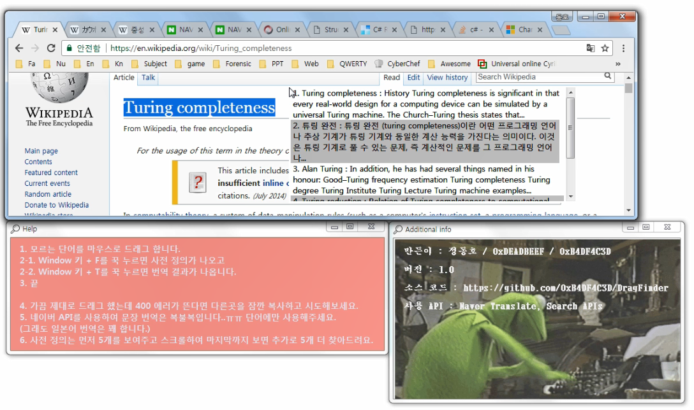
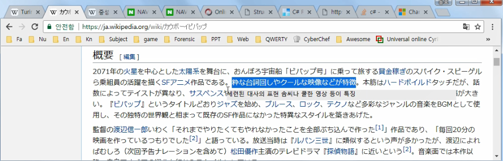
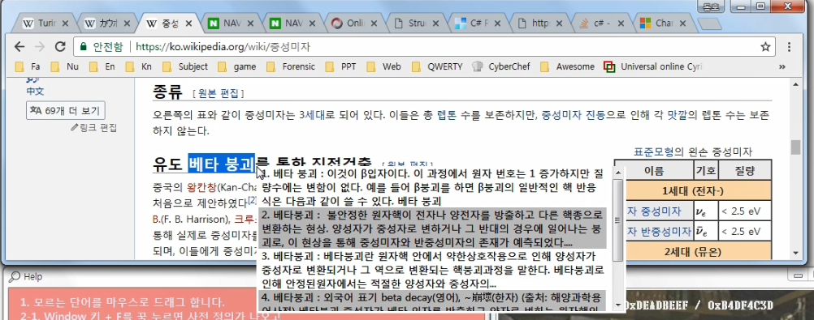
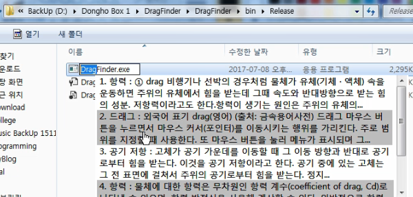
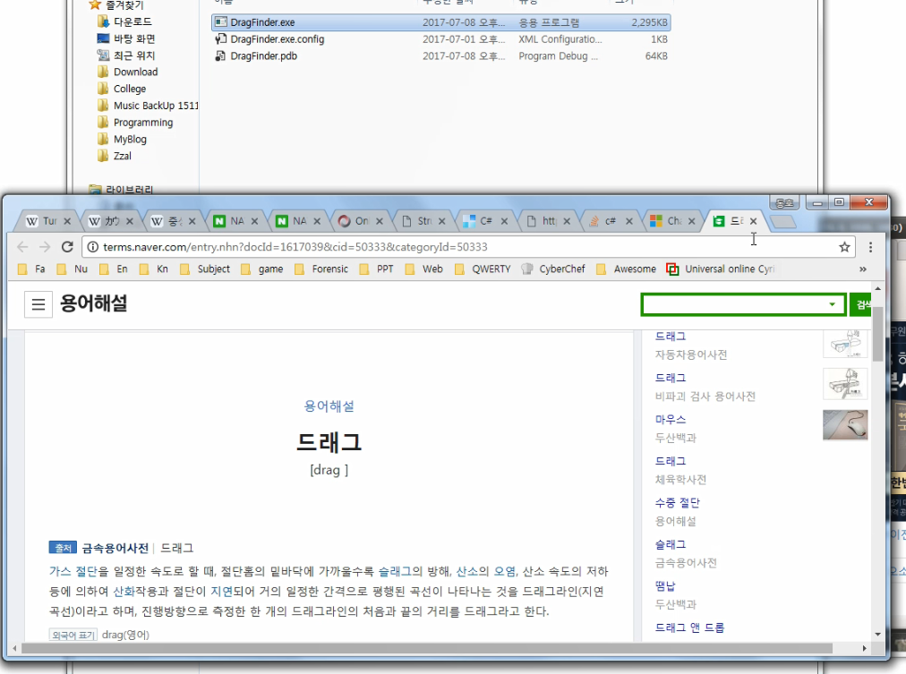
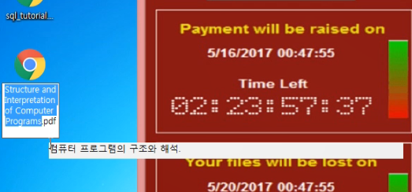

Edited by 0xDEADBEF
Wed, 05 Jul 2017 16:13:07 GMT

# DragFinder

**파일은 https://github.com/0xB4DF4C3D/DragFinder/blob/master/bin/Release/DragFinder.exe 여기서 다운로드하시면 됩니다.**

## 설명

드래그 하면 찾아주는 도구입니다.

좀 더 부연설명을 하면 다음과 같습니다.

1. 찾을 단어를 **드래그** 합니다.
1. 그리고 *Window키 + F* 를 누르면 **사전적 정의** 가 나옵니다.
1. 또는 *Window키 + T* 를 누르면 **단어의 번역** 이 나옵니다.

사전적 정의는 먼저 5개를 보여주고 스크롤을 통해 마지막까지 보게되면 추가로 찾아서 보여줍니다.

ClipBoard를 이용하기 때문에 만약 현재 복사된 단어를 찾으려고 하면 에러가 납니다. 이 때는 임시로 아무거나
복사한 뒤 검색하면 됩니다.

그리고 슬픈 일이지만 아직 네이버 API 질이 좋지 못해 가급적 **단어 번역** 만 부탁 드립니다.

## 사용 예

### 일본어 번역

### 한글 사전 정의

### 사전 정의 링크

자세히 보고 싶은 사전 정의를 클릭하면 브라우저에서 열립니다.

### 영어 번역

### 중국어도 되긴 할텐데 제가 중국어를 몰라서 테스트를 못했습니다.

 
 
 
## 비하인드
원래 고딩때 AHK로 만든것을 C#으로 다시 만든 버전입니다. 다만 이전에는 저작권 개념을 잘 몰라서 파싱으로 처리 했는데 이번에는 API로 처리하였습니다.. 원래 이것도 파싱으로 만들었었는데 네이버와 사전 저작권 문제가 잘 안풀려서 API로 뜯어 고치게 되었습니다.( 연락이 안됨ㅠㅠ ) 장점이라면 속도가 빠르다는건데.. 후.. API가 아직 부족한게 많네요.  

그리고 오픈소스로 올린 이유는 피드백을 받기 위해서입니다. WinForm은 거의 처음써보는거라서 막힐때마다 구글링해서 해결했어요. 분명 개선할것이 많을 거라 생각합니다. 사실 테스팅도 몇번 안한거라서 터지게 된다면 이메일이나 뭐든지 좋으니 남겨주시면 큰 도움이 될것입니다.

오픈 소스로 올렸는데 주석 안단거 죄송합니다. 지금 쌓인 일이 많아서 치우러가야 해서요.

감사합니다.
